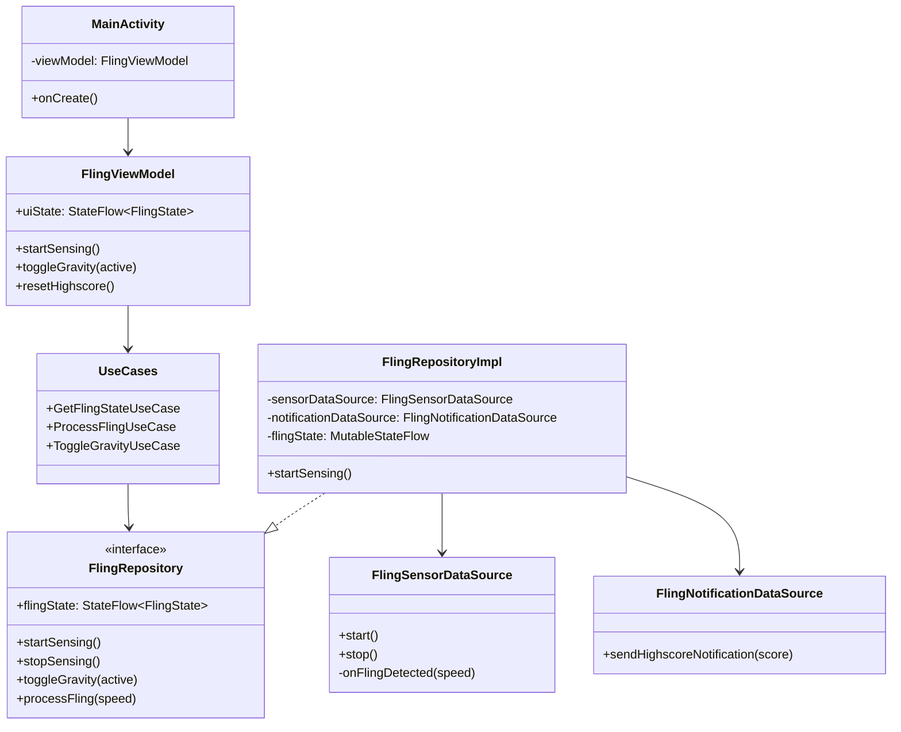
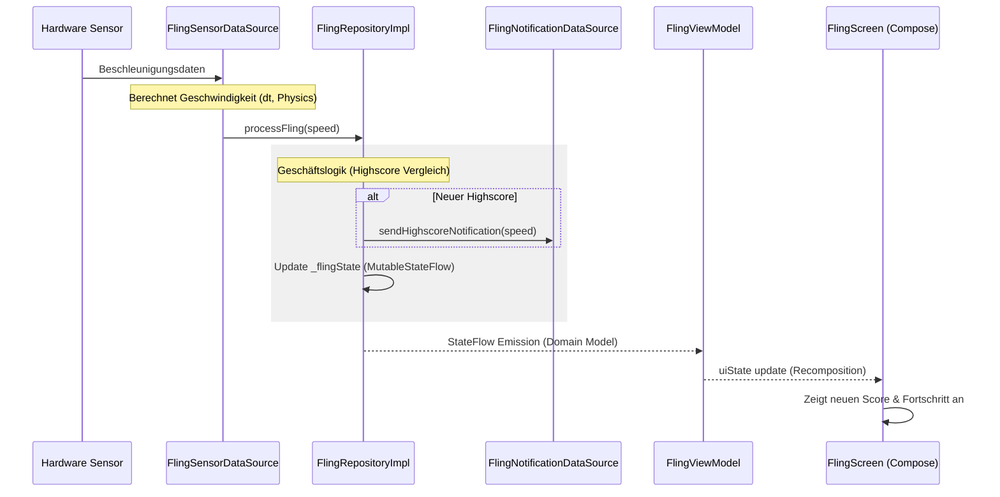

# FlingApp - Clean MVVM Architecture

Diese Anwendung demonstriert eine saubere Trennung von Belangen (Separation of Concerns) mithilfe der Clean MVVM Architektur. Die App erkennt "Fling"-Bewegungen des Smartphones über den Beschleunigungssensor, verwaltet einen Highscore und implementiert eine Gravitationsmechanik.

## Architektur-Übersicht

Die App ist in drei Hauptschichten unterteilt, um Testbarkeit und Wartbarkeit zu maximieren.

```mermaid
graph TD
    subgraph Presentation_Layer [Presentation Layer]
        UI[View: MainActivity, FlingScreen]
        VM[ViewModel: FlingViewModel]
    end
    
    subgraph Domain_Layer [Domain Layer]
        UC[Use Cases: GetFlingState, ToggleGravity, etc.]
        Model[Domain Model: FlingState]
        RepoIntf[Repository Interface: FlingRepository]
    end
    
    subgraph Data_Layer [Data Layer]
        RepoImpl[Repository Impl: FlingRepositoryImpl]
        DS_Sensor[SensorDataSource: FlingSensorDataSource]
        DS_Notif[NotificationDataSource: FlingNotificationDataSource]
    end

    UI --> VM
    VM --> UC
    UC --> RepoIntf
    RepoImpl ..|> RepoIntf
    RepoImpl --> DS_Sensor
    RepoImpl --> DS_Notif
    RepoIntf --> Model
```

## Komponenten-Diagramm

Detaillierte Übersicht der wichtigsten Klassen und ihrer Beziehungen.



## Datenfluss (Flow)

Der Ablauf von der Sensorerkennung bis zur Aktualisierung der Benutzeroberfläche.



## Schichten-Verantwortlichkeiten

1.  **Domain Layer**: Enthält das Herzstück der App. Die Use Cases definieren, was die App tut. Diese Schicht ist unabhängig von Android-Bibliotheken.
2.  **Data Layer**: Implementiert die Details. Hier findet die Interaktion mit dem Android `SensorManager` und `NotificationManager` statt.
3.  **Presentation Layer**: Verantwortlich für die Darstellung. Das ViewModel transformiert Daten aus der Domain-Schicht in einen für die UI leicht konsumierbaren Zustand.
